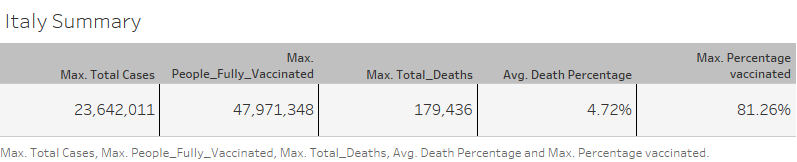

# **COVID DATA ANALYSIS**

**Introduction**: Coronavirus disease 2019 or SARS-CoV-2 is defined as illness caused serious and critical respiratory problem, which it was identified in Wuhan, Hubei, China in January 2020. Actually Covid infected almost 639M and has killed over 6M of people. 

In this analysis we will use a dataset where the last day of it is November 6th 2022. Our data is taken on website: https://ourworldindata.org/covid-deaths and before started own analysis we made a data cleaning, tipically phase for data scientist/analysit. 

**Data cleaning**: After downloading the dataset we splited it into two. The first one is care about information of deaths and the second one is about information on  vaccinated people. However being very large and confusional we thought was more convinient using some SQL server for manipulate dataset based on what we want, we used SQL Microsoft and it was possible to connect it to own server in tableau for data visualization. 
The script of SQL can be found in 'SQL data exploration.sql' in this reporty. 

**Analysis**: 

In own dataset we could do every analysis we want for any country, because I live in Italy I choose it as state for some initial consideration, than I considered all country yet.

Now we report the italian summary about Covid until 6th November 2022.

